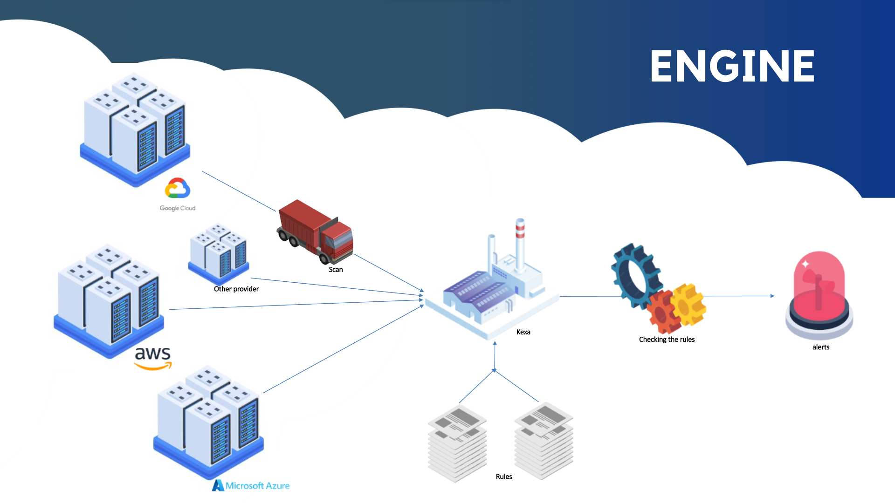

# Kexa

[![Contributors][contributors-shield]][contributors-url]
[![Forks][forks-shield]][forks-url]
[![Stargazers][stars-shield]][stars-url]
[![Issues][issues-shield]][issues-url]
[![Apache License][license-shield]][license-url]
[](https://www.bestpractices.dev/projects/9278)

<div align="center">
  <a href="https://www.kexa.io/">
    
  </a>
  <h3>Multi-Cloud Compliance Management Made Simple</h3>
</div>

## Overview

Kexa is an open-source compliance management tool that simplifies security and compliance across multiple cloud platforms including Azure, Google Cloud, AWS, and more. It provides:

- Real-time monitoring and instant alerts
- Simple, intuitive rule-based compliance checks
- Detailed compliance reports and analysis
- Seamless integration with existing tools
- Support for multiple deployment methods

Kexa works by scanning your cloud environments based on your configuration, applying customizable compliance rules, and notifying you of any violations. The process is simple:

1. **Scan**: Kexa scans your configured cloud environments using provider credentials
2. **Analyze**: It applies your defined compliance rules to the collected data
3. **Report**: Based on severity levels and notification settings, Kexa alerts you through your preferred communication channels

This straightforward scan-and-verify approach makes it easy to maintain compliance across your entire cloud infrastructure.

Here is an example of the Kexa engine:



## Quick Start

### Prerequisites

- BunJS installed
- Cloud provider credentials (Azure, AWS, GCP, etc.)

### Installation

1. Clone the repository:

    ```bash
    git clone https://github.com/kexa-io/Kexa.git
    cd Kexa
    ```

2. Install dependencies:

    ```bash
    bun install
    ```

3. Run Kexa:

    ```bash
    export INTERFACE_CONFIGURATION_ENABLED=false
    bun run ./Kexa/index.ts
    ```

4. You can configure Kexa by editing the `default.conf` file inside the `config` folder and re-run the script.

This will check the website kexa.io by default.

### Alternative Installation Methods

- **Docker**: Use our [Docker image](https://hub.docker.com/r/innovtech/kexa)
- **GitHub Action**: Use our [GitHub Action](https://github.com/kexa-io/Kexa_githubAction)
- **Kubernetes**: Deploy using our [Kubernetes manifests](documentation/Documentation-Kexa.md#kubernetes-1)
- **Azure Function**: Deploy as an [Azure Function](documentation/Documentation-Kexa.md#azure-function)

## Features

- **Multi-Cloud Support**: Works with major cloud providers (Azure, AWS, GCP)
- **Platform Support**: Integrates with GitHub, Kubernetes
- **Workspace Support**: Compatible with Office 365 and Google Workspace
- **Custom Rules**: Create and modify compliance rules to match your needs
- **Real-time Monitoring**: Get instant alerts for compliance violations
- **Flexible Deployment**: Run as a script, container, or cloud function
- **Extensible**: Add custom rules and community addons
- **Multiple Notification Channels**: Support for logs, email, SMS, webhooks, and Teams

## Documentation

For detailed documentation, including:

- Complete setup guide
- Rule configuration
- Deployment options
- Best practices

Visit our [Documentation](./docs/README.md)

## Contributing

We welcome contributions! Please see our [Contributing Guidelines](CONTRIBUTING.md) for details.

## Support

- Report bugs: [GitHub Issues](https://github.com/kexa-io/Kexa/issues)
- Request features: [GitHub Discussions](https://github.com/kexa-io/Kexa/discussions)
- Join our community: [Slack](https://kexaio.slack.com/)

## License

This project is licensed under the Apache License - see the [LICENSE](./LICENSE.txt) file for details.

## Contact

- Website: [kexa.io](https://www.kexa.io/)
- Email: [contact@kexa.io](mailto:contact@kexa.io)

<!-- MARKDOWN LINKS & IMAGES -->
[contributors-shield]: https://img.shields.io/github/contributors/kexa-io/Kexa.svg?style=for-the-badge
[contributors-url]: https://github.com/kexa-io/Kexa/graphs/contributors
[forks-shield]: https://img.shields.io/github/forks/kexa-io/Kexa.svg?style=for-the-badge
[forks-url]: https://github.com/kexa-io/Kexa/network/members
[stars-shield]: https://img.shields.io/github/stars/kexa-io/Kexa.svg?style=for-the-badge
[stars-url]: https://github.com/kexa-io/Kexa/stargazers
[issues-shield]: https://img.shields.io/github/issues/kexa-io/Kexa.svg?style=for-the-badge
[issues-url]: https://github.com/kexa-io/Kexa/issues
[license-shield]: https://img.shields.io/github/license/kexa-io/Kexa.svg?style=for-the-badge
[license-url]: https://github.com/kexa-io/Kexa/blob/master/LICENSE.txt
