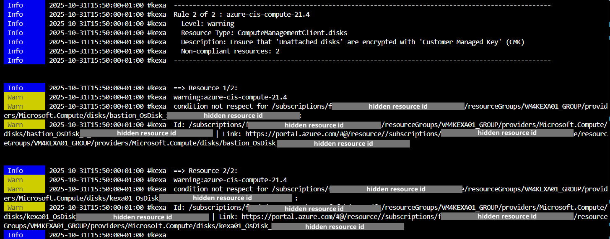
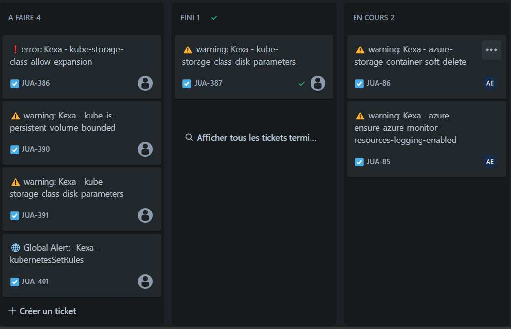
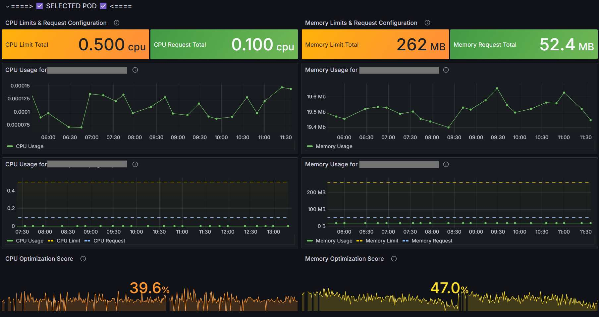
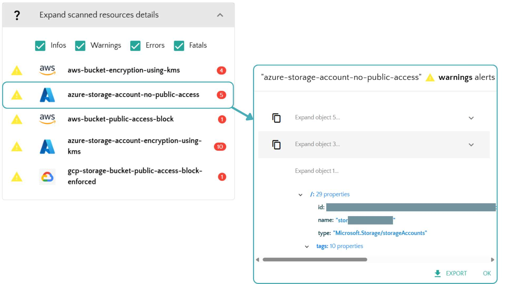

# Viewing Results

This guide shows examples of Kexa scan results across different output formats and visualization tools.


> **Configuration**: For setup instructions, see [Configuration](../configuration/README.md) and for notifications see [Notifications](../notifications/README.md).

## Console Output

<div align="center">
	
</div>

The console displays real-time scan progress with color-coded severity levels and completion statistics.

## HTML Reports

<div align="center">
	
</div>

HTML reports are automatically generated in the `/output/scans/<environment>/<YYYYMMDDHHmm>.html` folder with:
- Summary of all error levels (info to critical)
- Detailed rule violations and affected resources
- Clickable links to resources (when available)
- Resource identification details

## JSON Output

You can also generate JSON output files for programmatic access to gathering results with the argument `-o`.
The JSON files contain structured data about all the information collected during the scan.
It will generate at `/output/resources/<YYYYMMDDHHmm>.json` folder with the following structure:

```json
{
  "<providerA>": [
	{ // Environment 1
		"<resource_type1>": [
			{} // actual resource data
		],
		"<resource_type2>": [
			{}
		]
	},
	{ // Environment 2
		"<resource_type1>": [
			{}
		],
		"<resource_type2>": [
			{}
		]
	}
  ],
  "<providerB>": [
	{ // Environment 1
		"<resource_type3>": [
			{}
		]
	}
  ],
}
```

## Notification Examples

### Microsoft Teams

<div align="center">
	
</div>

Teams notifications show scan summaries with issue counts and resource links.

### Jira Integration

<div align="center">
	
</div>

<div align="center">
	
</div>

Jira automatically creates tickets with rules description and associated ressource.

## Grafana Dashboards

### Main Overview Dashboard

<div align="center">
	
</div>

### Kubernetes Dashboards

<div align="center">
	
</div>

<div align="center">
	
</div>

<div align="center">
	
</div>

Kubernetes-specific visualization showing CPU/memory utilization and optimization opportunities.

### SaaS Dashboard

<div align="center">
	
</div>

Detailed web interface to see all your scans history and alerts as well as your gathered cloud ressources,
with direct link to ressource when possible.

## Severity Levels

Example of use :

| Level | Name | Color Code | Examples |
|-------|------|------------|----------|
| 0 | **Info** | Blue | Status updates, resource counts |
| 1 | **Warning** | Yellow | Optimization opportunities, unused resources |
| 2 | **Error** | Orange | Security violations, compliance issues |
| 3 | **Fatal** | Red | Critical vulnerabilities, service disruptions |

---
