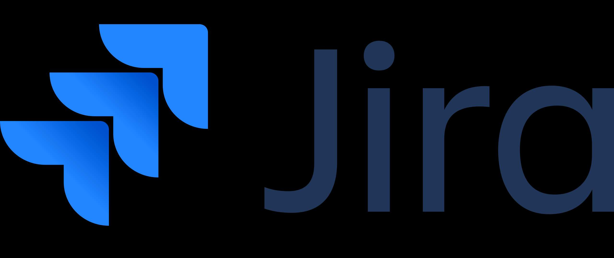
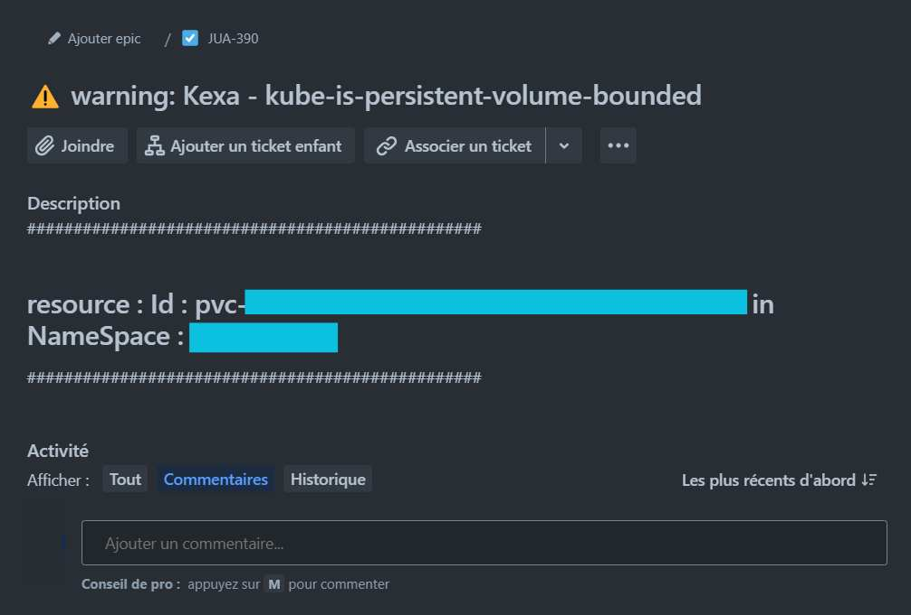

<div align="center">
    <a href="https://www.kexa.io/modules">
        
    </a>
</div>

<h3 align="center">Jira</h3>

<div>
  <p align="center">
    <br />
    <a href="https://github.com/4urcloud/Kexa/issues">Report Bug</a>
    ·
    <a href="https://github.com/4urcloud/Kexa/issues">Request Feature</a>
  </p>
</div>

By setting up 'Jira' notifications, you will receive alerts as issues in a desired Kanban, this will allow you to track and manage your optimization, security or compliance problems.

## Prerequire

To add Jira notifications, you will need to follow the steps below to set up the notifications. Start by creating a new Kanban project in Jira, and get your Jira API key: [Manage API tokens for your Atlassian account | Atlassian Support](https://support.atlassian.com/atlassian-account/docs/manage-api-tokens-for-your-atlassian-account/)

!! Warning !! Jira API has a rate limit, so for Jira you need to space out the time between scans. See your Jira API rate limit to avoid errors when retrieving the Jira tickets.

To avoid this, you can choose to only be notified of Errors & Fatals for example, and the rest in Global. That will reduce the number of generated issues.

You will also need the following (mandatory):

- Jira project ID
- Jira domain
- Jira issue type ID
- Jira done status ID

And optionally:

- Jira assignee id

To get those you'll first need your Kanban project.

Jira project ID is what you see in parentheses when looking at your project name in the project list.

<div align="center">
  
</div>

Jira domain is found in your URL when you're in your Jira project. (ex : yourname.atlassian.net)

To find the Jira issue type, go to 'parameter -> issues -> issue types' Then, when modifying an issue type, you will see the issue type id in the URL:

<div align="center">
  
</div>

Here it is "10000" for the issue type i want to use.

Now, to find your jira 'done' status. It is mandatory to avoid spamming the API.

Type your jira domain in the URL of a web browser followed by "rest/api/2/status", and you will get the list of status in your project. (ex : https://yourname.atlassian.netrest/api/2/status)

Find the one corresponding to the done status and save the id.

## Configuration

Now, set up the following variable in your environment :

```
JIRA_API_KEY='xxxxx@xxxx:xxxxxxxxxxxxxxxxxxxxxxxxxxxxxxxxx'
JIRA_DONE_STATUS='XXXXX'
JIRA_PROJECT_KEY='XXX'
JIRA_DOMAIN='xxxxxxxxxxxx.atlassian.net'
```

Last thing to do is in your rule file, in the notification section, set Jira with the issue type, and if you want, an assignee id.

<div align="center">
  
</div>

You're ready !

## Expected results

Here is an example of a Kanban, additionally, by clicking on a alert, you will see all the resource informations for remediation.

<div align="center">
  
</div>
<br/>

Here is what you got by clicking on a global alert:

<div align="center">
  
</div>
<br/>

And on a single alert:

<div align="center">
  
</div>
<br/>