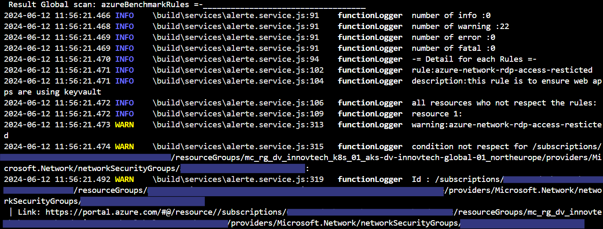

<div align="center">
    <a href="https://www.kexa.io/modules">
        
    </a>
</div>

<h3 align="center">Log</h3>

<div>
  <p align="center">
    <br />
    <a href="https://github.com/4urcloud/Kexa/issues">Report Bug</a>
    ·
    <a href="https://github.com/4urcloud/Kexa/issues">Request Feature</a>
  </p>
</div>

By setting up 'Log' notifications, Kexa will output alerts to the console/logs, making them available for viewing in your terminal.

## Prerequire

No external dependencies or services are required. Log notifications are built into Kexa.

## Configuration

Log notifications are configured in your rules file alongside other notification types:

```yaml
- version: 1.0.0
  date: 07-23-2024
  alert:
    fatal:
      enabled: true
      type: 
        - log
        - email  # Can combine with other notification types
      to:
        - 'email@gmail.com'
    error:
      enabled: true
      type: 
        - log
      to: 
    warning:
      enabled: true
      type: 
        - log
      to:
    info:
      enabled: true
      type: 
        - log
      to: 
    global:
      enabled: true
      type: 
        - log
      to: 
      conditions:
        - level: 0
          min: 1
        - level: 1
          min: 1
        - level: 2
          min: 1
        - level: 3
          min: 1
  rules:
    # all rules are here
```

## Expected Results

When log notifications are enabled, you will see detailed alert messages in your console output:

<div align="center">
  
</div>

The log output includes:
- Color-coded severity levels
- Resource details and identifiers
- Rule violations with descriptions
- Summary statistics

## Best Practices

- **Combine with other notifications**: Use logs alongside email/SMS for comprehensive alerting
- **Use for development/testing**: Logs are particularly useful when setting up and testing Kexa rules
- **Consider log management**: For production deployments, ensure your log rotation and management systems can handle the additional log volume

## Troubleshooting

**Logs not appearing:**
- Check that log notifications are enabled in your rules file
- Check log level configuration
- Verify Kexa is running and processing rules successfully
