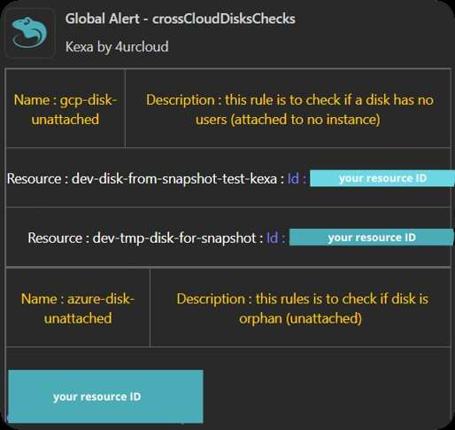

# Teams

<div align="center">
    <a href="https://www.kexa.io/modules">
        
    </a>

  <p align="center">
    <br />
    <a href="https://github.com/kexa-io/Kexa/issues">Report Bug</a>
    ·
    <a href="https://github.com/kexa-io/Kexa/issues">Request Feature</a>
  </p>
</div>

By setting up 'Teams' notifications, you will receive alerts as Teams card in a desired channel, with links and/or informations to help you remediate asap.

## Requirements

For this notification type, you will only need your MS Teams webhook from the channel you want: [Create an Incoming Webhook — Teams | Microsoft Learn](https://learn.microsoft.com/en-us/microsoftteams/platform/webhooks-and-connectors/how-to/add-incoming-webhook?tabs=newteams%2Cdotnet)

## Configuration

The notifications are set up in each rule file. Open the rule file for which you want to set up the Teams notifications.

Here is an example of how to set teams, replace `YourTeamsWebhook` with the webhook your retrieved with the link above.

You can also uncomment the ‘_- log_’ lines, so you will be also alerted by logs when an alert is raised.

```yaml
- version: 1.0.0 # Enter your rule file version if needed
  date: 07-23-2024 # Enter the date of creation if needed
  alert:
    fatal:
      enabled: true
      # set enabled to false to disable fatals notifications
      type: 
        - teams
        #- log   
        # uncomment this to enable logs for fatals
      to:
        - 'YourTeamsWebhook'
    error:
      enabled: true
      type: 
        - teams
        #- log
      to: 
        - 'YourTeamsWebhook'
    warning:
      enabled: true
      type: 
        - teams
        #- log
      to:
        - 'YourTeamsWebhook'
    info:
      enabled: true
      type: 
        - teams
        #- log
      to: 
        - 'YourTeamsWebhook'
    global:
      enabled: true
      type: 
        - teams
        #- log
      to: 
        - 'YourTeamsWebhook'
      conditions:
        - level: 0
          min: 1
        - level: 1
          min: 1
        - level: 2
          min: 1
        - level: 3
          min: 1
  # minimum alerts to be raised before notifying
  rules:
  # all rules are here
```

## Expected Results

Here is an example of what you will receive in your Teams channel :


