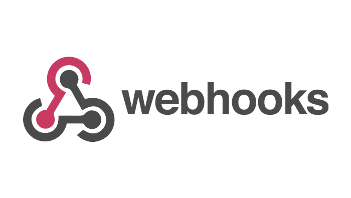

<div align="center">
    <a href="https://www.kexa.io/modules">
        
    </a>
</div>

<h3 align="center">Webhook</h3>

<div>
  <p align="center">
    <br />
    <a href="https://github.com/4urcloud/Kexa/issues">Report Bug</a>
    ·
    <a href="https://github.com/4urcloud/Kexa/issues">Request Feature</a>
  </p>
</div>

By setting up 'Webhook' notifications, you can integrate Kexa alerts with any custom system or service that accepts HTTP POST requests, enabling seamless integration with your existing workflows.

## Prerequire

To use webhook notifications, you need:

- An HTTP endpoint that accepts POST requests
- The endpoint URL (HTTP or HTTPS)

### Common Webhook Use Cases:

- **Chat integrations** (Slack, Discord, etc.)
- **Custom applications** and microservices
- **Custom dashboards** and monitoring systems

## Configuration

Webhook notifications are configured directly in your rules file. No environment variables are required for basic webhook functionality.

### Basic Webhook Configuration:

```yaml
- version: 1.0.0
  date: 07-23-2024
  alert:
    fatal:
      enabled: true
      type: 
        - webhook
        - log   
      to:
        - 'https://your-api.example.com/kexa-alerts'
        - 'https://hooks.slack.com/services/YOUR/SLACK/WEBHOOK'
    error:
      enabled: true
      type: 
        - webhook
      to: 
        - 'https://hooks.slack.com/services/YOUR/SLACK/WEBHOOK'
    warning:
      enabled: true
      type: 
        - webhook
      to:
        - 'https://hooks.slack.com/services/YOUR/SLACK/WEBHOOK'
    info:
      enabled: true
      type: 
        - webhook
      to: 
        - 'https://hooks.slack.com/services/YOUR/SLACK/WEBHOOK'
    global:
      enabled: true
      type: 
        - webhook
      to: 
        - 'https://hooks.slack.com/services/YOUR/SLACK/WEBHOOK'
      conditions:
        - level: 0
          min: 1
        - level: 1
          min: 1
        - level: 2
          min: 1
        - level: 3
          min: 1
  rules:
    # all rules are here
```

### Authentication:

Webhook URLs are configured directly in the rules file. For webhooks that require authentication, contact the maintainers for implementation details.

## Best Practices

- **Secure endpoints**: Use HTTPS for webhook URLs
- **Error handling**: Implement proper error handling and logging
- **Rate limiting**: Consider rate limiting on your webhook endpoints

### Example Webhook Handler (Node.js/Express):

```javascript
app.post('/kexa-webhook', (req, res) => {
  try {
    const payload = req.body;
    // Process the alert based on your needs
    // Implementation depends on the actual payload structure
    processKexaAlert(payload);
    res.status(200).json({ status: 'processed' });
  } catch (error) {
    console.error('Webhook processing error:', error);
    res.status(500).json({ error: 'Processing failed' });
  }
});
```

## Troubleshooting

**Webhooks not being called:**
- Verify the webhook URL is accessible from your Kexa instance
- Ensure the endpoint responds to POST requests