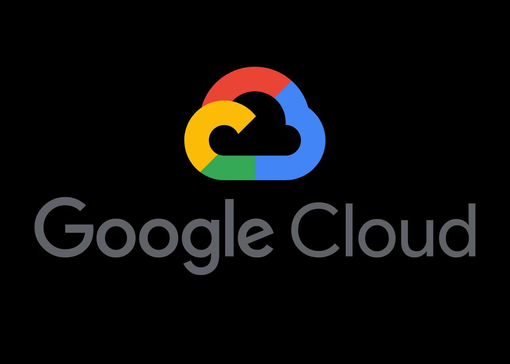

<div align="center">
    <a href="https://www.kexa.io/addOn/gcp">
        
    </a>
</div>

# GCP addOn

<div>
  <p align="center">
    Optimize the security of your assets on Google Cloud with our industry-leading data scan addon, offering advanced protection, complete visibility and foolproof compliance to ensure your data remains secure in the cloud.
    <br />
    <a href="https://github.com/kexa-io/Kexa/issues">Report Bug</a>
    ·
    <a href="https://github.com/kexa-io/Kexa/issues">Request Feature</a>
  </p>
</div>

## Configuration

### Default.json

For each of your environments, the following keys are mandatory:

- `rules`: This refers to the set of rules files you want to apply to this environment.
- `prefix`: the prefix is the particle to be placed in front of the environment variables to be quoted [here](#environment).

The following keys are recommended to ensure better readability when re-reading the configuration:

- `name`: The name refers to the environment concerned by one or more keywords.
- `description`: the description helps to clarify the name and avoid any possible confusion about the environment concerned

You can also specify the regions you want to scan, this can be used to avoid scanning all regions and reduce execution time.
Without specifying this, all regions will be scan.

- `regions`: The list of the regions name you want to scan, refer to [GCP regions name](https://cloud.google.com/compute/docs/regions-zones).

Example of [configuration for 2 GCP environments](../../config/demo/gcp.default.json).

### Environment

There are several ways to identify yourself in an Google Cloud environment. Obviously, you can only scan the environment for which you are at least a `reader` role:

```bash
GOOGLE_PROJECT_ID=XXXXXXXXXX            # Google Project ID
GOOGLE_APPLICATION_CREDENTIALS=XXXXXXXX # Content of credentials.json
```

## Additional documentation

[GCP NodeJs References](https://cloud.google.com/nodejs/docs/reference)
