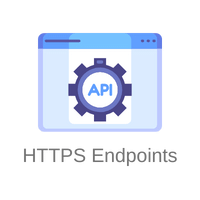

<div align="center">
    <a href="https://www.kexa.io/addOn/azure">
        
    </a>

# HTTP(s) addOn

  <p align="center">
    Ensure optimal service performance with our API endpoint data scan add-on, which gives you a real-time view of your systems' health, enabling you to maintain robust, uninterrupted online services.
    <br />
    <a href="https://github.com/kexa-io/Kexa/issues">Report Bug</a>
    ·
    <a href="https://github.com/kexa-io/Kexa/issues">Request Feature</a>
  </p>
</div>

## Configuration

### Default.json

For each of your EndPoint, the following keys are mandatory:

- `rules`: this refers to the set of rules files you want to apply to this environment.
- `prefix`: the prefix is the particle to be placed in front of the environment variables to be quoted [here](#environment).
- `METHOD`: It's define the way to communicate with the endpoint: `GET`, `POST`, `DELETE`, `PATCH`, ....
- `URL`: destination of the request

Optional keys to add more detail to your request:

- `header`: it's a JSON that collapse all your additional key/value you want. If you want to add AUTHORIZATION please refer to [environment](#environment)
- `body`: You can pass want ever you want except file

The following keys are recommended to ensure better readability when re-reading the configuration:

- `name`: the name refers to the environment concerned by one or more keywords.
- `description`: the description helps to clarify the name and avoid any possible confusion about the environment concerned.

Example of [configuration for 2 Http environments](../../config/demo/http.default.json).

### Environment

You can add authorization to your request but it's not mandatory. However you want it:

```bash
AUTHORIZATION=
```

note that `METHOD` and `URL` can also be set as environment variables instead of in `default.json`.

## Additional documentation

If you want to have more documentation about :

- the API you want request, please refer to its documentation.
- our request, we use [axios](https://axios-http.com/docs/intro).
