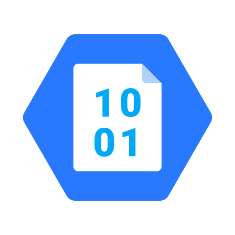

<div align="center">
    <a href="https://www.kexa.io/">
        
    </a>

# Azure Blob Storage

  <p align="center">
    Azure Blob Storage addon for Kexa save and export operations
    <br />
    <a href="https://github.com/4urcloud/Kexa/issues">Report Bug</a>
    ·
    <a href="https://github.com/4urcloud/Kexa/issues">Request Feature</a>
  </p>
</div>

## Configuration

### Required Fields

- **type**: `"azureblobstorage"`
- **containerName**: Azure Blob Storage container name

### Authentication Options

Choose one of the following authentication methods:

#### Option 1: Account Name and Key
- **accountName**: Azure Storage Account name
- **accountKey**: Azure Storage Account access key

#### Option 2: Connection String  
- **urlName**: Complete Azure Storage connection string

#### Option 3: Default Credentials
- **accountName**: Azure Storage Account name
- Uses Azure default credentials (Managed Identity, Azure CLI, etc.)

### Example Configurations

#### With Account Key
```json
{
  "save": [
    {
      "type": "azureblobstorage",
      "containerName": "kexa-scan-results",
      "accountName": "AZURE_STORAGE_ACCOUNT_NAME",
      "accountKey": "AZURE_STORAGE_ACCOUNT_KEY",
      "name": "Production Blob Storage",
      "description": "Azure Blob Storage for scan results",
      "origin": "kexa-production",
      "tags": {
        "environment": "production"
      },
      "onlyErrors": false
    }
  ]
}
```

#### With Connection String
```json
{
  "export": [
    {
      "type": "azureblobstorage",
      "containerName": "kexa-data-exports", 
      "urlName": "AZURE_BLOB_CONNECTION_STRING",
      "name": "Data Export Storage",
      "description": "Raw infrastructure data export",
      "origin": "kexa-analytics",
      "tags": {
        "purpose": "analytics"
      }
    }
  ]
}
```

Example of configuration for [each identification](../../config/demo/azureBlobStorage.default.json) you can use.

## Environment Variables

### Account and Key Method
```bash
export AZURE_STORAGE_ACCOUNT_NAME="mystorageaccount"
export AZURE_STORAGE_ACCOUNT_KEY="base64encodedkey=="
```

### Connection String Method
```bash
export AZURE_BLOB_CONNECTION_STRING="DefaultEndpointsProtocol=https;AccountName=mystorageaccount;AccountKey=base64key==;EndpointSuffix=core.windows.net"
```

## Data Storage

- **File Format**: JSON files organized by date and scan type
- **Container Structure**: Automatic organization with timestamps
- **Access Tiers**: Support for Hot, Cool, and Archive tiers
- **Encryption**: Server-side encryption enabled by default

## Features

- **Scalable Storage**: Virtually unlimited storage capacity
- **Access Tiers**: Cost optimization with different storage tiers
- **Managed Identity**: Secure authentication without keys
- **Global Availability**: Multi-region storage options
- **Integration**: Native Azure ecosystem integration

## Troubleshooting

- **Container Not Found**: Ensure container exists and is accessible
- **Authentication Failed**: Verify account name, key, or connection string
- **Access Denied**: Check storage account permissions and firewall rules
- **Network Issues**: Verify connectivity to Azure Storage endpoints