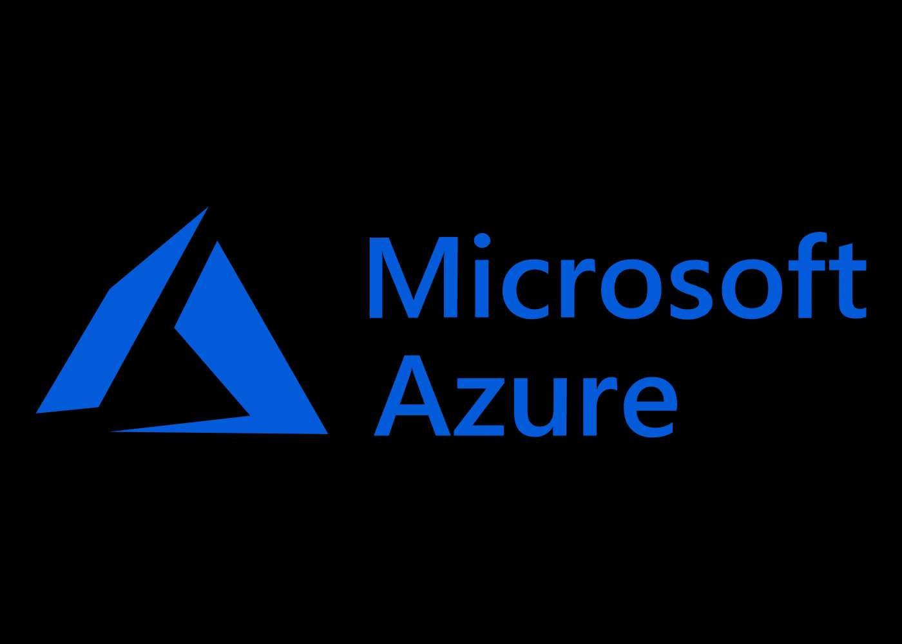

<div align="center">
    <a href="https://www.kexa.io/addOn/azure">
        
    </a>

# <h3 align="center">Azure addOn</h3>

  <p align="center">
    Optimize your Azure experience with our new data scan add-on, simplifying the management and analysis of your critical information, for more informed decisions than ever.
    <br />
    <a href="https://github.com/4urcloud/Kexa/issues">Report Bug</a>
    ·
    <a href="https://github.com/4urcloud/Kexa/issues">Request Feature</a>
  </p>
</div>

## Configuration

### Default.json

For each of your environments, the following keys are mandatory:

- "rules": This refers to the set of rules files you want to apply to this environment.
- "prefix": the prefix is the particle to be placed in front of the environment variables to be quoted [here](#environment).

The following keys are recommended to ensure better readability when re-reading the configuration:

- "name": The name refers to the environment concerned by one or more keywords.
- "description": the description helps to clarify the name and avoid any possible confusion about the environment concerned.

Example config for 2 environments:


### Environment

There are several ways to identify yourself in an Azure environment. Obviously, you can only scan the environment for which you are at least a "reader":

- [Service principal](https://learn.microsoft.com/en-us/azure/active-directory/develop/howto-create-service-principal-portal) must be use by default in many of your case:

```shell
SUBSCRIPTIONID=XXXXXXXX-XXXX-XXXX-XXXX-XXXXXXXXXXXX   (ID of your subscription)
AZURECLIENTID=XXXXXXXX-XXXX-XXXX-XXXX-XXXXXXXXXXXX	(ID of an Azure AD application)
AZURETENANTID=XXXXXXXX-XXXX-XXXX-XXXX-XXXXXXXXXXXX	(ID of the application's Azure AD tenant)
AZURECLIENTSECRET=XXXXXXXX-XXXX-XXXX-XXXX-XXXXXXXXXXXX	(one of the application's client secrets)
```

- If you are runnning your Kexa in a azure function you can also use this with [UAI (User Assigned Identities)](https://learn.microsoft.com/en-us/azure/active-directory/workload-identities/workload-identity-federation-create-trust-user-assigned-managed-identity) and it's recommended if you want use an Azure Keyvault:

```bash
USERAZUREIDENTITYID=XXXXXXXX
```

- If you are using your Kexa in an Azure CLI environment and are already logged in, you do not need to log in again. Your credentials will be used during the scan.

## Additional documentation

[Azure NodeJs SDK](https://github.com/Azure/azure-sdk-for-js/tree/main)
