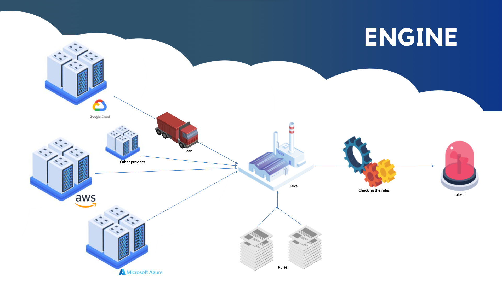

<!-- PROJECT LOGO -->
<br />
<div align="center" id="top">

  <a href="https://www.kexa.io/">
    
  </a>

# <h3 align="center">Kexa</h3>

  <p align="center">
    Generic alert tools to ensure the quality of your infrastructure. Avoid wasting money on useless infrastructure, avoidable security breaches and service malfunctions.
    <br />
    <a href="https://github.com/4urcloud/Kexa"><strong>Explore the docs »</strong></a>
    <br />
    <br />
    <a class="github-button" href="https://github.com/4urcloud/Kexa/issues" data-color-scheme="no-preference: dark_high_contrast; light: dark_high_contrast; dark: light_high_contrast;" data-icon="octicon-issue-opened" data-size="large" aria-label="Issue 4urcloud/Kexa on GitHub">Report Bug</a>
    ·
<a class="github-button" href="https://github.com/4urcloud/Kexa/discussions" data-color-scheme="no-preference: dark_high_contrast; light: dark_high_contrast; dark: light_high_contrast;" data-icon="octicon-comment-discussion" data-size="large" aria-label="Discuss 4urcloud/Kexa on GitHub">Request Feature</a>
	·
<a class="github-button" href="https://github.com/4urcloud/Kexa" data-color-scheme="no-preference: dark_high_contrast; light: dark_high_contrast; dark: light_high_contrast;" data-icon="octicon-star" data-size="large" aria-label="Star 4urcloud/Kexa on GitHub">Put Star</a>
  </p>
</div>


<!-- TABLE OF CONTENTS -->
<details>
  <summary>Table of Contents (Full documentation)</summary>
  <ol>
    <li>
      <a href="#global-understanding">Global understanding</a>
    </li>
    <li>
      <a href="#prerequisites">Prerequisites</a>
    </li>
    <li>
      <a href="#global-configuration">Global Configuration</a>
      <ul>
        <li><a href="#configuration-via-script">Configuration Via Script</a></li>
        <li><a href="#basic-configuration">Basic Configuration</a></li>
        <li><a href="#multiple-environments-provider-prefix">Multiple Environments provider prefix</a></li>
	<li><a href="#custom-and-multiple-configurations">Custom and multiple Configurations</a></li>
        <li><a href="#regions">Regions</a></li>
      </ul>
    </li>
    <li>
      <a href="#environment-variables-and-auth">Environment variables & Auth</a>
      <ul>
        <li><a href="#directory--notifications">Directory & Notifications</a>
          <ul>
            <li><a href="#default-folder-input-and-output">Default folder input and output</a></li>
            <li><a href="#notification">Notification</a></li>
            <li><a href="#save-result-of-the-scan">Save result of the scan</a></li>
          </ul>
        </li>
        <li><a href="#providers-authentications">Providers Authentications</a></li>
        <li><a href="#password-manager">Password Manager</a></li>
      </ul>
      </li>
    <li>
      <a href="#rules-editing">Rules Editing</a>
      <ul>
        <li><a href="#rules-fields">Rules fields</a></li>
        <li><a href="#date--time-criteria">Date & Time criteria</a></li>
        <li><a href="#full-yaml-rules-file">Full Yaml rules file</a></li>
        <li><a href="#utility-examples">Utility examples</a>
            <ul>
                <li><a href="#cost-savings">Cost savings</a></li>
                <li><a href="#safety-guarantee">Safety Guarantee</a></li>
                <li><a href="#standardization">Standardization</a></li>
                <li><a href="#community">Community</a></li>
            </ul>
        </li>
      </ul>
    </li>
    <li>
      <a href="#official-addons">Official Addons</a>
    </li>
    <li>
      <a href="#community-addons">Community Addons</a>
      <ul>
                <li><a href="#getting-new-addons">Getting new addons</a></li>
                <li><a href="#contributing">Contributing</a>
                <ul>
                    <li><a href="#forking-project">Forking project</a></li>
                    <li><a href="#adding-functionalities">Adding functionalities</a></li>
                    <li><a href="#gathering-data">Gathering data</a></li>
                    <li><a href="#display-results">Display results</a></li>
                    <li><a href="#tests">Tests</a></li>
                </ul></li>
        </ul>
    </li>
    <li><a href="#how-to-launch-kexa">How to launch Kexa</a>
                <ul>
                    <li><a href="#local">Local</a></li>
                    <li><a href="#docker">Docker</a></li>
                    <li><a href="#azure-function">Azure function</a></li>
                    <li><a href="#kubernetes-deploy">Kubernetes</a></li>
                </ul>
    </li>
  </ol>
</details>

# <div align="center" id= "global-understanding">**Global Understanding**</div>

We'll discuss how Kexa works in principle, and explain the usefulness of the various elements in the process at each stage.



- The first step is to scan your environment. To avoid trying to scan all environments, we use a config that lets you describe which providers will be used. In this configuration, we then define the project(s) in this provider and the rule sets associated with them.

- To perform the scans, addOns retrieves the credentials you've set up for each project. Priority is given to the credentials present in your key manager, and if not set up, then in the environment variables.

- Once all the scans have been made, we apply the rules you've defined to the data. We detect any resource that doesn't conform to any of your rules.

- Finally, depending on :
  - the severity levels associated with the rule in question
  - the notification presets present in the rule set where the rule is present.

  Kexa notifies you on your communication channels

The principle is simple: scan and verify. That's why you have 2 main elements to set up:
  - the default.json to know what to scan and what to scan with
  - the set of rules to know what Kexa has to verify

# <div align="center" id= "prerequisites">**Prerequisites**</div>

First of all, Kexa is build with [node](https://nodejs.org/en) so you need to [install it](https://nodejs.org/en/download)
* npm
  ```sh
  npm install npm@latest -g
  ```

## Installation

### Clone the repo

- CLI:

   ```bash
   git clone https://github.com/4urcloud/Kexa.git
   ```

<!--- Github Desktop:

  ```
  x-github-client://openRepo/https://github.com/4urcloud/Kexa
  ```
  [](x-github-client://openRepo/https://github.com/4urcloud/Kexa)-->


- SSH:

  ```bash
  git@github.com:4urcloud/Kexa.git
  ```

- Download ZIP:

  [](https://github.com/4urcloud/Kexa/archive/refs/heads/main.zip)

- Visual Studio:

  
  [](https://vscode.dev/github/4urcloud/Kexa)

### Install NPM packages
   ```sh
   npm install
   ```

# <div align="center" id= "global-configuration">**Global Configuration**</div>

<br/>
In the Kexa config folder, edit the default.json (create it if it doesn't exist)
<br/>

<div id="configuration-via-script"></div>

## **Configuration via script**

A powershell script is available for easy downloading, updating and configuration of Kexa versions.

We don't yet have a Bash script for Linux. You can follow [this documentation](https://learn.microsoft.com/en-us/powershell/scripting/install/installing-powershell-on-linux?view=powershell-7.4) to run the powershell script on linux.

### Downloads or update Kexa

You can download a version of Kexa from a specific branch. To do this, there's the "-d" argument to request a Kexa pull locally without Github. To preset from which branch this should be done, you have the "-b" argument followed by a branch name present on our repository (by default: main). Finally, if you don't want to perform the download where you are, you can use "-p" followed by the path to where to perform the manipulation.
An option is available for Kexa to update itself automatically with the 'AUTOUPDATE' environment variable. It will update on all non-breaking updates. If you decide not to update it automatically, Kexa will notify you via the logs of the latest available version.
Note: in the event of an upgrade, your configuration files will be preserved.

Here's an example:

- Linux

  ```bash
  #for download the script localy
  curl -sSL https://raw.githubusercontent.com/4urcloud/Kexa/main/initKexa.sh -o initKexa.sh

  #to update or download Kexa locally with the main branch
  ./initKexa.sh -d
  #to update or download Kexa at ./Kexa with the dev branch
  ./initKexa.sh -d -b dev -p ./Kexa
  ```

- Windows

  ```powershell
  #for download the script localy
  Invoke-WebRequest -Uri "https://raw.githubusercontent.com/4urcloud/Kexa/main/initKexa.ps1" -OutFile "./initKexa.ps1"

  #to update or download Kexa locally with the main branch
  ./initKexa.ps1 -d
  #to update or download Kexa at ./Kexa with the dev branch
  ./initKexa.ps1 -d -b dev -p ./Kexa
  ```

### Setup configuration

A powershell script located at "./initKexa.ps1" allows you to set up a configuration and all your necessary environment variables. It also downloads from our github repo the basic rules per provider you've configured.
Note, executing the command is destructive to your previous configuration.

- Windows:

  ```powershell
  ./initKexa.ps1 -c
  ```

- Linux:
  ```bash
  sudo pwsh
  ./initKexa.ps1 -c
  ```
  Our bash file does not yet support Kexa configuration. However, our powershell script does.


<div id="basic-configuration"></div>

## **Basic configuration**

Here you can define the providers you want to retrieve data from, and for each one, which rules file you want to check.
- You can find the available providers name for this in /enum/provider.enum.ts
- The 'rules' field is mandatory to specify the rules to be applied to each environment.

```yaml
{
  "azure": [
    {
      "name": "MyAzureSubscription",
      "description": "First subscription description",
      "rules": [
        "Name of my rule"
      ]
    },
  ],
  "gcp": [
	  {
		"name": "MyGCPProject",
	    "description": "First project description",
	    "rules": [
		    "Name of my rule"
	    ]
	  }
  ]
}
```


<br/>
<div id="multiple-environment-provider-prefix"></div>

## **Multiple environments provider prefix**

For every provider you can define multiple projects to make custom verifications for your  subscriptions.
Each projects in this list refers to a "subscription"/"environment". It's a good idea to give each project a name and a description, to make it easier to understand

 The 'prefix' field is optional, but you may need it if you want to have multiple authentication / variables for a provider. It corresponds to the environment index.
	This will allow you to identify the variables used to log on your different environment. ( if not specified, a default value will be assigned )
	- This attribute should be unique, unless you want to use the same identifiers more than once on several environments

```yaml
{
  "azure": [
    {
      "name": "Project A",
      "prefix": "PROJECTA_", #(if not specify it would have been: '0')
      "description": "First subscription (0) : Project A subscription",
      "rules": [
        "Name of my rule"
      ]
    },
    {
      "name": "Project B",
      "prefix": "PROJECTB_", #(if not specify it would have been: '1')
      "description": "Second subscription (1) : Project B subscription",
      "rules": [
        "Name of my rule",
        "Another rules"
      ]
    }
  ]
}
```
<br/>

<div id="custom-and-multiple-configurations"></div>

## **Custom and multiple configurations**

As we said before, `/config/default.json` is the default file path for your Kexa projects configuration.
But you can edit this and have multiple configuration files to switch between.

First, delete the `default.json` configuration file, so it won't be taken into account. (think about backup if you need it)

There is a `/config/env/` folder available in Kexa, if not, you can create it.
In this folder you will be able to store multiple configuration files, each having a custom name.

To use a custom file, set the following environment variable :

```sh
NODE_CONFIG_TS_ENV=customName
```

Replace `customName` by your file name (that will always have '.json' extension).
Do not forget to delete or move away `default.json` to avoid conflicts.

In addition, you can also use the `/config/deployment/` and `/config/user/` folder, by using for each `DEPLOYMENT=customName` or `USER=customName`.
For more information, check [node-config-ts](https://www.npmjs.com/package/node-config-ts#custom-config-directory) documentation.

<br/>

<div id="regions"></div>

## **Regions**

For Amazon Web Services and Google Cloud Provider (or other official addons using regions), you can choose to select specifics regions to check. 
Without "regions" property (or empty "regions" property), all the regions will be checked.

```yaml
{
  "aws": [
    {
      "name": "Project A",
      "prefix": "AWSPROJECTA_", #(if not specify it would have been: '0')
      "description": "First subscription (0) : Project A subscription",
      "rules": [
        "Name of my rule"
      ],
      "regions": [
        "us-east-1"
      ]
    }
  ],
  "gcp": [
    {
      "name": "Project B",
      "prefix": "GCPPROJECTB_", #(if not specify it would have been: '0')
      "description": "First subscription (0) : Project B subscription",
      "rules": [
        "Name of my rule",
        "Another rules"
      ],
      "regions": [
        "us-east1"
      ]
    }
  ]
}
```
<br/>
<p align="right">(<a href="#top">back to top</a>)</p>

# <div align="center" id="environment-variables-and-auth">**Environment variables & Auth**</div>
<br/>

<div id="directory-notifications"></div>

## **Directory & Notifications**

<div id="default-folder-input-and-output"></div>

### **Default folder input and output**

Specify a folder to store the rules files.
```
  RULESDIRECTORY=./Kexa/rules (default value)
```

Specify a folder to store the output files.
```
  OUTPUT=./output (default value)
```

You can modify your rule files to customize the notification channels on which to have your alerts. The "alert" section in rules files is designed for this purpose. It is possible to set up individual alerts by resource and by level of importance, but above all global alerts that summarize the scan. Go to [Full Yaml Rules File](#full-yaml-rules-file) to have more information.

<div id="notification"></div>

### **Notification**

Setup your notification tools. (for those selected in your rules files).
>email
```
 EMAILPORT=587
  EMAILHOST=smtp.sendgrid.net
  EMAILUSER=apikey
  EMAILPWD=XXXXXXXXXXXXXXX
  EMAILFROM='"Kexa" <noreply@4urcloud.eu>'
```

For email, EMAILPWD is your Api Key for the case you use sendgrid.

> sms (with Twilio)
```
 SMSFROM='+00000000000'
  SMSACCOUNTSID=XXXXXXXXXXXXXXXXXXXXXXXXXXXXXXXXXXXXXX
  SMSAUTHTOKEN=XXXXXXXXXXXXXXXXXXXXXXXXXXXXXXXXXXXXXX
```

<div id="save-result-of-the-scan"></div>

### **Save result of the scan**

You can save your scan results in various places :
- [Azure Blob Storage](./save/AzureBlobStorage.md)
- [Mongo DB](./save/MongoDB.md)

To save your scan results in different places, a "save" attribute must be created in your default.json file. It's a list of "SaveConfig" objects, as follows : 


Here's the table of correspondence for each attribute:
- type: corresponds to the name of the addon solicited to save your scan
- urlName: 2 functions to choose from:
  - is used to provide the name of the environment variable storing the endpoint url
  - provide endpoint url
- name: reserved attribute for naming the backup location (maintenance aid)
- description: reserved attribute to describe the backup location (maintenance aid)
- origin: attribute to specify kexa run location
- tags: additional information dictionary for tagging the backup
- onlyErrors: Boolean to record only errors detected or not

Each addOn brings its own unique set of attributes to the table. We invite you to refer to the documentation of the addOn you wish to use for all the subtleties.
Here an example of configuration to save in Azure Blob Storage and MongoDB:


<br/>
<div id="provider-authentications"></div>

## **Providers Authentications**

For each environment you want to test, you'll need to provide the environment variables needed to authenticate to it. For this you can refer to the addons section corresponding to each addon:

- [AWS](./provider/AWS.md)
- [Azure](./provider/Azure.md)
- [GCP](./provider/GCP.md)
- [Github](./provider/Github.md)
- [Google drive](./provider/GoogleDrive.md)
- [Google workspace](./provider/GoogleWorkspace.md)
- [HTTP(HTTPS)](./provider/HTTP.md)
- [Kubernetes](./provider/Kubernetes.md)
- [O365](./provider/O365.md)

An environment file is also available in our repository, with every official addon's needed variables.
You can use it by filling the field corresponding to the providers you want to authenticate to.

<br/>
<div id="password-manager"></div>

## **Password manager**

You can optionally use a key manager; for these variables no prefix are needed. Those variables does not refer to any specific environment, but simply to the runner space. The following environment variables must be present in the runner environment. The preceding environment variables cited in this or other documentation may not be present in the runner environment, but in your password manager. Variables in your manager will be "simulated" as being present locally and will only be known in the environment when the value is used:

- **Azure**: To refer to your Key Vault add this following environement variable :
    
    ```
      AZUREKEYVAULTNAME=MyKeyVault
      AZURE_CLIENT_ID=XXXXXXXXXXXX
      AZURE_TENANT_ID=XXXXXXXXXXXX
      AZURE_CLIENT_SECRET=XXXXXXXX
    ```
    
    You can also use this combination with UAI (User Assigned Identities) recommended when using Kexa in an azure function:
    
    ```
      AZUREKEYVAULTNAME=MyKeyVault
      USERAZUREIDENTITYID=XXXXXXXX
    ```
    
- **AWS**: To refer to your Key Vault add this following environement variable :
    
    ```
      AWS_SECRET_NAME=XXXXXXXXX
      AWS_ACCESS_KEY_ID=XXXXXXXXX  
      AWS_SECRET_ACCESS_KEY=XXXXXXXXX
    ```
    
- **Hashicorp Vault**: To refer to your Hashicorp Vault add this following environement variable :
    
    ```
      HCP_CLIENT_ID=XXXXXXXXX
      HCP_CLIENT_SECRET=XXXXXXXXX  
      HCP_API_URL=XXXXXXXXX
    ```
    You will find your HCP_CLIENT_ID and HCP_CLIENT_SECRET by creating a service principal on Hashicorp and generating them : [Create a service principal on Hashicorp](https://developer.hashicorp.com/hcp/docs/hcp/admin/iam/service-principals)

    You will find your HCP_API_URL in your application secret list, in the bottom "api" section, "Read Your Secrets" -> 'location' field.
    
    Or you can create it like so :
     ```
     https://api.cloud.hashicorp.com/secrets/2023-06-13/organizations/{yourOrganizationID}/projects/{yourProjectID}/apps/{yourAppName}/open
    ```

    You will need to change the date '2023-06-13' to the latest Hashicorp Vault api version : [Hashicorp Vault API references](https://developer.hashicorp.com/hcp/api-docs/vault-secrets#OpenAppSecret)

<br/>
<p align="right">(<a href="#top">back to top</a>)</p>

# <div align="center" id="rules-editing">**Rules Editing**</div>

<div id="rules-fields"></div>

## **Rules fields**

The default path for your folder rules is "./Kexa/rules". You can change it with the environment variable "RULESDIRECTORY".
Here is the structure and required fields for a new rule :

```yaml
- name: string 
  # the name of the rule to set in your ./config/default.json
  description : string 
  # the description of the rule
  applied: boolean 
  # active or ignore this rule
  level: enum 
  # the warning level to trigger (defined in ./enum/level.enum.ts)
  cloudProvider: enum 
  # the target provider: defined in ./enum/provider.enum.ts for the official one and can be more longer with your own addOn
  objectName : enum 
  # the target object name. You can have the list of the objectName supported by your provider in the headers of his addOn
  conditions: # the list of criteria to match
		-	property : string 
	 		# the object field name to check (you can see the objects fields by launching Kexa with npm run start:o option)
      # for any property with a dot in his name, add "/" before the dot
			condition : enum 
			# the condition for this comparison (defined in ./enum/condition.enum.ts)
			value : string 
			# the value to compare with (refer to the official provider documentation)

	  # add more criteria by starting a new '- property:' here #
```

You can also cross operations with logical operators :

```yaml
- name: string 
  description : string 
  applied: boolean 
  level: enum 
  cloudProvider: enum 
  objectName : enum 
  conditions:
   - operator : enum
   # the operator to apply accross criterias (defined in ./enum/operator.enum.ts)
      criteria:
		- property : string 
		  condition : enum 
		  value : string 
		  # first criteria
		- property : string 
		  condition : enum 
		  value : string
		  # second criteria

		# add more criteria by starting a new '- property:' here #

	
```

With nested operations :

```yaml
- name: string 
  description : string 
  applied: boolean 
  level: enum 
  cloudProvider: enum 
  objectName : enum 
  conditions:
   - operator : enum
   # the operator to apply accross criterias (defined in ./enum/operator.enum.ts)
      criteria:
		- property : string 
		  condition : enum 
		  value : string 
		# first criteria
		- property : string 
			condition : enum 
			value : # nested operation
				- operator: AND
			  	criteria:
						-	property : string 
							condition : enum 
							value : string 
							# first criteria
						-	property : string 
							condition : enum 
							value : string 
							# second criteria
		 
		# add more criteria by starting a new '- property:' here #

	
```

<br/>
<div id="date-and-time-criteria"></div>

## **Date & time criteria**

You can also set up date and time comparison for your rules, we have built a set of specific conditions and fields for this feature :

```yaml
property: string
condition: (
  DATE_EQUAL |
  DATE_SUP |
  DATE_INF |
  DATE_SUP_OR_EQUAL |
  DATE_INF_OR_EQUAL |
  INTERVAL |
  DATE_INTERVAL
)
value: 0 0 0 0 0 0
# time value to compare. We use NCronTab Normalization format. The values given in this value are subtracted from the current time.
#In reading order, numbers have values in seconds, minutes, hours, weeks, months, years. That means 0 0 0 0 0 is equal to now.
# few examples: 
# - 0 0 1 0 0 0 = now minus one hour
# - 0 0 0 0 2 0 = now minus 2 month
date: "YYYY-MM-DDThh:mm:ss.SSSZ"
# the format of the date you want to parse (the one used in the resource object field).
# few examples:
# "2023-10-23" = "YYYY-MM-DD"
# "23-10 / 12:27" = "DD-MM / HH:mm"
```

<br/>

<div id="full-yaml-rules-file"></div>

## **Full Yaml rules file**

```yaml
- version: string
  # to indicate the version of this yaml (xxx.xxx.xxx)
  date: string
  # to indicate the date of this yaml (dd-mm-yyyy)
  alert:
  # area to create your custom notification
    info: # alert settings for info level (level 0)
      enabled: boolean
      # to enable or ignore the notification individually
      type:
        - enum
        - ...
      # add every type of notification you want (email|sms|webhook|log|teams)
      to:
        - string
        - ...
      # add all the endpoint you need according to the type of notification you have
      # (for example : myemail@email.com or +3306070809)
    warn: # alert settings for warning level (level 1)
      enabled: boolean
      type:
        - enum
      to:
        - string
    error: # alert settings for error level (level 2)
      enabled: boolean
      type:
        - enum
      to:
        - string
    fatal: # alert settings for fatal level (level 3)
      enabled: boolean
      type:
        - enum
      to:
        - string
    global: # alert settings for the global sum up
      enabled: boolean
      # to enable or deactivate this file of rules
      type:
        - enum
      to:
        - string
      conditions:
      # condition for each level, how many is required before alerting
        - level: 0
          min: int
        - level: 1
          min: int
        - level: 2
          min: int
        - level: 3
          min: int
  rules: # the list of the rules, refer to the previous section explaining rules
	- name: string 
	# rule here #
	- name: string
	# rule here #
	
	# Add as much rules as you want by starting a new '-name' #
	
```

<br/>
<p align="right">(<a href="#top">back to top</a>)</p>

<div id="utility-examples"></div>

## **Utility examples**

<div id="cost-saving"></div>

### **Cost savings**

By automating the monitoring of your infrastructure's status and behaviour, our tool enables you to make significant savings.
By detecting rule violations quickly, you can avoid the additional costs associated with prolonged problems and prevent costly malfunctions.

For example, a rule for alerting if there is an orphan disk:

```yml
- name: "azure-disk-orphan"
  description : "this rules is to check if disk is orphan"
  applied: true
  level: 1 #warn
  cloudProvider: azure
  objectName : disk
  conditions:
    - property : diskState
      condition : DIFFERENT
      value : Unattached
```

<br/>
<div id="safety-guarantee"></div>

### **Safety guarantee**

By defining specific security rules, you can constantly check that good practice is being followed and that your infrastructure is protected against potential threats.
The tool alerts you in the event of non-compliance, enabling you to take corrective action quickly and maintain a high level of security.

Example of rule to verify:

```yml
- name: azure-disk not public or encrypted
  description : "this rules is to check if disk is either not public or encrypted by default"
  applied: true
  level: 2
  cloudProvider: azure
  objectName : disk
  conditions:
    - operator : OR
      rules:
        - property : networkAccessPolicy
          condition : DIFFERENT
          value : AllowAll
        - property : encryption.type
          condition : EQUAL
          value : EncryptionAtRestWithPlatformKey
```

<br/>

<div id="standardization"></div>

### **Standardization**

Rules can help you to implement consistent operating standards. This makes it easier to manage your entire environment and helps you maintain a stable, predictable infrastructure.

By standardizing configurations and behaviors, you reduce the risk of human error and unforeseen malfunctions.

Exemple of rule to normalise names among tags:

```yml
  - name: check-tags-on-aks-cluster
    description : "this rules is to check if aks cluster are conform to the tag norms"
    applied: true
    level: 2
    cloudProvider: azure
    objectName : aks
    conditions:
      - property : tags.environment
        condition : REGEX
        value : [DEV | NPR | PROD]
      - property : tags.author
        condition : DIFFERENT
        value : NULL
      - property : tags.billing
        condition : REGEX
        value : ^(VADOR|YODA|LUKE)$
```

<br/>
<div id="community"></div>

### **Community**

Our infrastructure health check tool promotes a community-based approach that encourages collaboration and knowledge exchange between users.

One of the key features of our tool is its flexibility, allowing users to customize and adjust the rules to suit their specific needs. The rules are easily shared using simple YAML files, making it easy to spread best practice and innovative ideas.

Whether you want to check specific elements of your infrastructure or take a more general approach, the possibilities are endless. Everyone is free to design and share their own use cases, providing a wealth of resources for the community as a whole.

<br/>
<p align="right">(<a href="#top">back to top</a>)</p>
<div id="official-addons"></div>

## <div align="center">**Official Addons**</div>

<div id="aws"></div>

### **AWS**

Strengthen the security of your AWS resources with our state-of-the-art data scan addon, guaranteeing complete protection of your sensitive data, enhanced compliance and unrivalled peace of mind in the cloud.

- [AWS](./provider/AWS.md)

<div id="azure"></div>

### **Azure**

Optimize your Azure experience with our new data scan add-on, simplifying the management and analysis of your critical information, for more informed decisions than ever.

- [Azure](./provider/Azure.md)

<div id="gcp"></div>

### **GCP**

Optimize the security of your assets on Google Cloud with our industry-leading data scan addon, offering advanced protection, complete visibility and foolproof compliance to ensure your data remains secure in the cloud.

- [GCP](./provider/GCP.md)

<div id="github"></div>

### **GITHUB**

Optimize your GitHub workflow easily with our brand new data collection addon, enabling you to analyze and make the most of your development data, for projects that perform better than ever.

- [Github](./provider/Github.md)

<div id="google-drive"></div>

### **GOOGLE DRIVE**

Reinvent the way you work with Google Drive with our revolutionary data scan add-on, simplifying the collection, organization and analysis of your files and information for unprecedented productivity in the cloud.

- [Google Drive](./provider/GoogleDrive.md)

<div id="google-workspace"></div>

### **GOOGLE WORKSPACE**

Increase the security and compliance of your Google workspace with our state-of-the-art data scan add-on, offering proactive protection, comprehensive monitoring and seamless data management for confident communications and collaboration.

- [Google Workspace](./provider/GoogleWorkspace.md)

<div id="http"></div>

### **HTTP**

Ensure optimal service performance with our API endpoint data scan add-on, which gives you a real-time view of your systems' health, enabling you to maintain robust, uninterrupted online services.

- [HTTP](./provider/HTTP.md)

<div id="kubernetes-addon"></div>

### **Kubernetes**

Take the security of your Kubernetes environments to the next level with our data scan addon, guaranteeing proactive monitoring and unrivalled protection of your clusters, for total peace of mind in the container world.

- [Kubernetes](./provider/Kubernetes.md)

<div id="o365"></div>

### **O365**

Ensure total confidentiality and seamless compliance within your Office 365 environment with our industry-leading data scan addon, giving you real-time monitoring, advanced protection and simplified management of sensitive information.

- [O365](./provider/O365.md)

<p align="right">(<a href="#top">back to top</a>)</p>
<div id="community-addons"></div>

## <div align="center">**Community Addons**</div>

<div id="getting-new-addons"></div>

### **Getting new addons**

To use a community addon, simply download the required {AddonName}Gathering.service.ts and {AddonName}Display.service.ts, and move them in the /services/addOn and /services/addOn/display folder in the Kexa root directory.

You will need to refer to the addOn documentation to get information about the required environment variable, gathered data or specific configuration fields.

<br/>

<div id="contributing"></div>

### **Contributing**

Contributions are what make the open source community such an amazing place to learn, inspire, and create. Any contributions you make are **greatly appreciated**.

If you have a suggestion that would make this better, please fork the repo and create a pull request. You can also simply open an issue with the tag "enhancement". Don't forget to give the project a star! Thanks again!

<br/>

<div id="forking-project"></div>

### **Forking project**

1. Fork the Project
2. Create your Feature Branch (`git checkout -b feature/AmazingFeature`)
3. Commit your Changes (`git commit -m 'Add some AmazingFeature'`)
4. Push to the Branch (`git push origin feature/AmazingFeature`)
5. Open a Pull Request

<br/>

<div id="adding-functionalities"></div>

### **Adding functionalities**
	
Each published addOn is free to set its own mandatory key values for its default.config configuration schema.
Our minimum values for any addOn are "rules". Keys such as "prefix", "name" and "description" are strongly recommended to maintain ease of use.

We've set up a system to facilitate the development of new features. This system is based on the "addOn" system. To develop a new feature, you don't need to know the whole project. You can develop additional services to collect additional data, among which you can make rules.

<br/>

<div id="gathering-data"></div>

### **Gathering data**

A file to collect data whose path will be "./Kexa/services/addOn". It is named as follows: [extension's name]Gathering.service.ts . The entry point for this file is a function named "collectData", which takes one arguments. The argument is a list containing all the configs for your addOn. This list corresponds to what you can find in the default.json file in the key that has the same name as your addOn. As additional information per item in the list, you have "ObjectNameNeed" which corresponds to the CategoryItem solicity in the rules set up. This helps you, to optimize your addOn and make faster, more targeted collections. The return format of this function is as shown in the following example. exemple :
	
```json
[
  {
    "categoryItem1": [
      {},
      {},
      {}
    ],
    "categoryItem2": [
      {},
      {}
    ]
  },
  {
    "categoryItem1": [
      {}
    ],
    "categoryItem2": [
      {},
      {},
      {}
    ]
  }
]
```

The data format is the following for several reasons. The first list corresponds to the different subscriptions or accounts in a sector. To illustrate, in the case of a cloud provider such as Azure, we might need different identifiers to scan all our accounts, and each account scan result is an item in the list. The dictionaries in the main list correspond to your dictionary that you find relevant to create to identify the different resources of your addOn, in the rules this corresponds to your "objectName". Finally, the lowest-level lists correspond to the list of items collected by your addOn.

For project maintainability, we require addOn modules to contain a header to quickly identify certain information. It's also important to update this header according to the capabilities of your addOn. In fact, this header serves as a basis for checking the feasibility of certain rules. This header is a comment that must contain at least 2 pieces of information: the name of the module and the "categoryItems" you've included in your module. example for an "azureComplement" module: file name : azureComplementGathering.service.ts

```ts
/*
    * Provider : azure
    * Creation date : 2023-08-14
    * Note : Important note for understand what's going on here
    * Resources :
    *    - secretManager
    *    - SP
    *    - azFunction
*/

export async function collectData(myAddonConfig: any[]){
  //the type of myAddonConfig is "any" but you can make an interface if you want

  //insert your stuff here
}

//can add other function here
```
	
<br/>

<div id="display-results"></div>

### **Display results**

The display data file has for name schema : [same extension's name]Display.service.ts, its path will be: "./Kexa/services/addOn/display". This file is used to display precise attributes of an object to quickly identify it in its environment. This return is done by returning a string, with the possibility of putting html in this sting. The function used as an entry point is named "propertyToSend". It takes 3 arguments. The first is a "Rules", and the relative path to the object definition is


The second is an "any", corresponding to an object you've collected previously. Finally, the last element is a boolean, which you'll set to false by default. It corresponds to your obligation not to put html in your string. Example display file for an "azureComplement" module: file name : azureComplementGathering.service.ts

```ts
import { Rules } from "../../../models/settingFile/rules.models";

export function propertyToSend(rule: Rules, objectContent: any, isSms: boolean=false): string{
    //you can also use a switch on rule.objectName to perform a specific return for each type of objectName you create with your addOn
    //it is advisable to make a default return to cover all possible cases.
    if (isSms)
        return `Id : `+ objectContent?.id + `https://portal.azure.com/#@/resource/` + objectContent?.id
    else
        return `Id : <a href="https://portal.azure.com/#@/resource/` + objectContent?.id + '">' + objectContent?.id + `</a>`
}

//can add other function here
```

<br/>

<div id="save-results"></div>

### **Save results**

You can also add AddOns to save your data. These extensions are based on the same principle as Display AddOn. The Save AddOn file is named [extension name]Save.service.ts, and its path is "./Kexa/services/addOn/save". This file is used to store the scanned data in a specific location. No return is attempted. The function used as an entry point is called "save". It takes 2 arguments. The first is a "save", corresponding to :


But you can make your own by extends this interface.
The second is a table of ResultScan:


example of fresh template of save addOn:

```ts
import { ResultScan } from "../../../models/resultScan.models";

export async function save(save: SaveConfig, result: ResultScan[][]): Promise<void>{
  //insert your stuff here
}

//can add other function here
```

<br/>

<div id="tests"></div>

### **Tests**

We've set up some tests you can use to validate the integration of your addOn:

```shell
npm run test
```

Other checks are carried out at various stages to validate the integration of your addOn and the rules you can design. However, these checks are only carried out during software execution. Indeed, due to the nature of certain data collections, it is not possible to carry out "cold" tests without having access to dedicated environments.
<p align="right">(<a href="#top">back to top</a>)</p>

<div id="how-to-launch-kexa"></div>

## <div align="center">**How to launch Kexa**</div>

<div id="local"></div>

### **Local**

Use this command to launch scans:

```shell
npm run start
```

<br/>

<div id="docker"></div>

### **Docker**

Build the image

```shell
docker build -t kexa .
```

Or pull it from our repository [here](https://hub.docker.com/r/innovtech/kexa)

```shell
docker pull innovtech/kexa
```

Run the image don't forget to add your nested environment variable

```shell
docker run -d kexa
```

However if you want to run kexa with a special config or rules, you can perform it with mount. Using the "-v" attribute when running docker, you can add your own folders from one to several:

- set your own configuration:

```shell
docker run -d -v Absolute/Path/to/config:/app/config kexa
```

- set your own rules:

```shell
docker run -d -v Absolute/Path/to/rules:/app/kexa/rules kexa
```

<br/>

<div id="azure-function"></div>

### **Azure function**

To run the deployment commands, make sure that your "func" command is functional. If it is not, you can install it with this command:

```shell
npm i -g azure-functions-core-tools@4 --unsafe-perm true
```

Build your version with your config

```shell
npm run build
```

To test azure function locally :

```shell
func start
```

To publish Kexa to your azure function

```shell
func azure functionapp publish [Name of your function app]
```

<br/>

<div id="kubernetes-deploy"></div>

### **Kubernetes**

Build the image with your config done

```shell
docker build -t kexa .
```

create a yaml file named "kexa.yaml" such as. (Follow rules cited before for the env variables, this is just an example) :

```yaml
apiVersion: batch/v1
kind: CronJob
metadata:
  name: kexacronjob
  namespace: kexa
spec:
  schedule: "0 0 * * *"  # Planning for a daily run at midnight
  jobTemplate:
    spec:
      template:
        spec:
          restartPolicy: Never
          containers:
          - name: mykexacontainer
            image: kexa:latest
            env:
              # add all environment variables need
```

create the namespace:

```shell
kubectl create namespace kexa
```

deploy it:

```shell
kubectl apply -f kexa.yaml
```

Checked that everything went smoothly :

```shell
kubectl get cronjob kexacronjob -n kexa
```

You're supposed to have something like:

```shell
NAME          SCHEDULE    SUSPEND   ACTIVE   LAST SCHEDULE   AGE
kexacronjob   0 0 * * *   False     0        <none>          3m33s
```

<p align="right">(<a href="#top">back to top</a>)</p>
