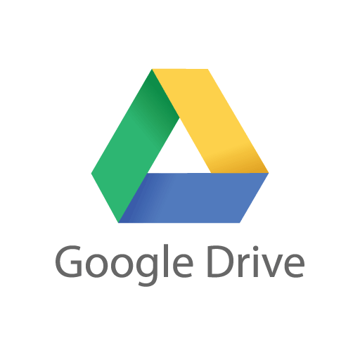

<div align="center">
    <a href="https://www.kexa.io/addOn/github">
        
    </a>

# <h3 align="center">Google Drive addOn</h3>

  <p align="center">
    Reinvent the way you work with Google Drive with our revolutionary data scan add-on, simplifying the collection, organization and analysis of your files and information for unprecedented productivity in the cloud.
    <br />
    <a href="https://github.com/4urcloud/Kexa/issues">Report Bug</a>
    ·
    <a href="https://github.com/4urcloud/Kexa/issues">Request Feature</a>
  </p>
</div>

## Configuration

### Default.json

For each of your environments, the following keys are mandatory:

- "rules": This refers to the set of rules files you want to apply to this environment.
- "prefix": the prefix is the particle to be placed in front of the environment variables to be quoted [here](#environment).

The following keys are recommended to ensure better readability when re-reading the configuration:

- "name": The name refers to the environment concerned by one or more keywords.
- "description": the description helps to clarify the name and avoid any possible confusion about the environment concerned.

Example config for 2 environments:


### Environment

[here](https://developers.google.com/workspace/guides/create-credentials) you can create your credential to get access through Kexa to your environment

```bash
DRIVECRED='{
    "installed": {
        "client_id": "XXXXXXXXXXXXXXXXX.apps.googleusercontent.com",
        "project_id": "",
        "auth_uri": "https://accounts.google.com/o/oauth2/auth",
        "token_uri": "https://oauth2.googleapis.com/token",
        "auth_provider_x509_cert_url": "https://www.googleapis.com/oauth2/v1/certs",
        "client_secret": "",
        "redirect_uris": [
        ]
    }
}'
```

## Additional documentation

[Drive SDK JS](https://developers.google.com/drive/api/quickstart/nodejs)
