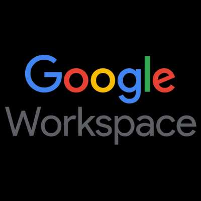

<div align="center">
    <a href="https://www.kexa.io/addOn/googleWorkspace">
        
    </a>

# <h3 align="center">Azure addOn</h3>

  <p align="center">
    Increase the security and compliance of your Google workspace with our state-of-the-art data scan add-on, offering proactive protection, comprehensive monitoring and seamless data management for confident communications and collaboration.
    <br />
    <a href="https://github.com/4urcloud/Kexa/issues">Report Bug</a>
    ·
    <a href="https://github.com/4urcloud/Kexa/issues">Request Feature</a>
  </p>
</div>

## Configuration

### Default.json

For each of your environments, the following keys are mandatory:

- "rules": This refers to the set of rules files you want to apply to this environment.
- "prefix": the prefix is the particle to be placed in front of the environment variables to be quoted [here](#environment).

The following keys are recommended to ensure better readability when re-reading the configuration:

- "name": The name refers to the environment concerned by one or more keywords.
- "description": the description helps to clarify the name and avoid any possible confusion about the environment concerned.

Example config for 2 environments:


### Environment

There are several ways to identify yourself in an Azure environment. Obviously, you can only scan the environment for which you are at least a "reader":

```shell
WORKSPACECRED=''  (content of credentials.json)
```

## Additional documentation

[Azure NodeJs SDK](https://github.com/Azure/azure-sdk-for-js/tree/main)
