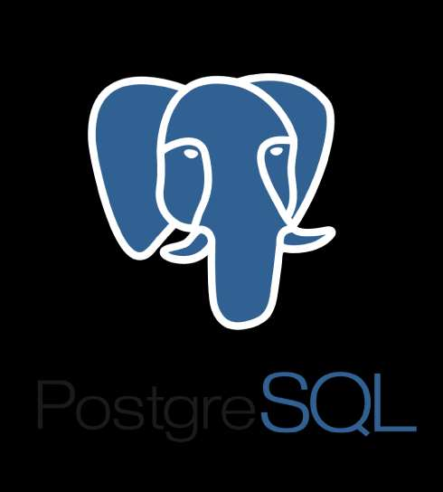

    

# <h3 align="center">Postgres</h3>

  

     
    <a href="https://github.com/4urcloud/Kexa/issues">Report Bug</a>
    ·
    <a href="https://github.com/4urcloud/Kexa/issues">Request Feature</a>
  

## Configuration

### Prerequire

Creation of a database. All tables and constraints will be created automatically if required.

### Default.json

For each of your database, keys mandatory:

- "urlName": uri connection to access (with database in the uri)

Configuration is the same as for mySQL but with your postgres connection string.

### Environment

urlName can be use to refer to a specific value in your environnement with his name as value.

### Schema of the database

